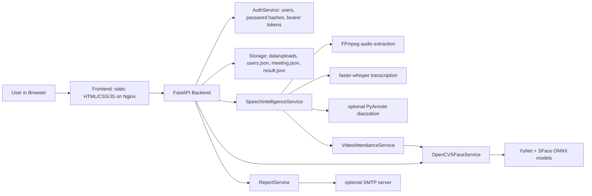
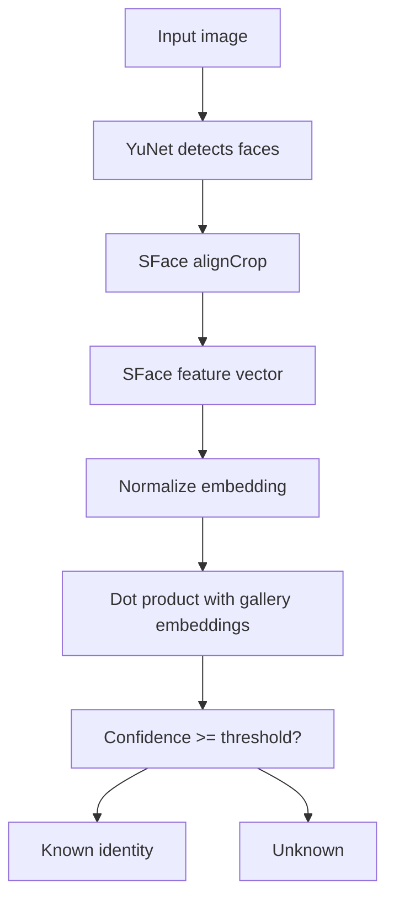
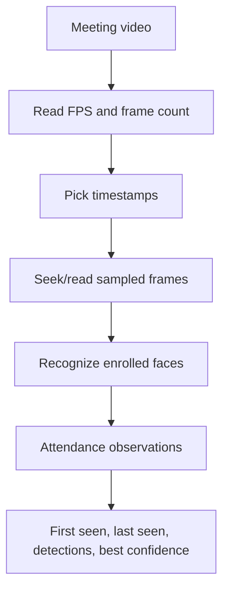
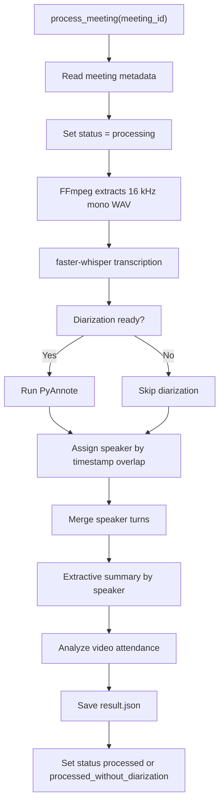
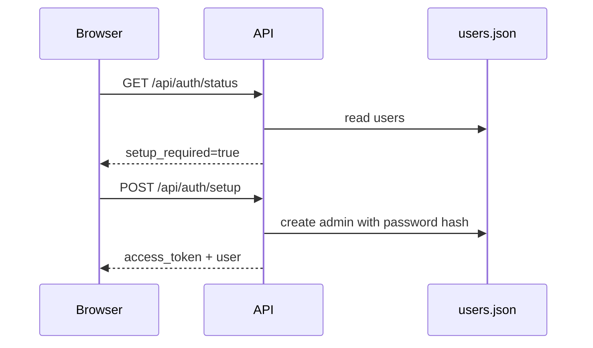
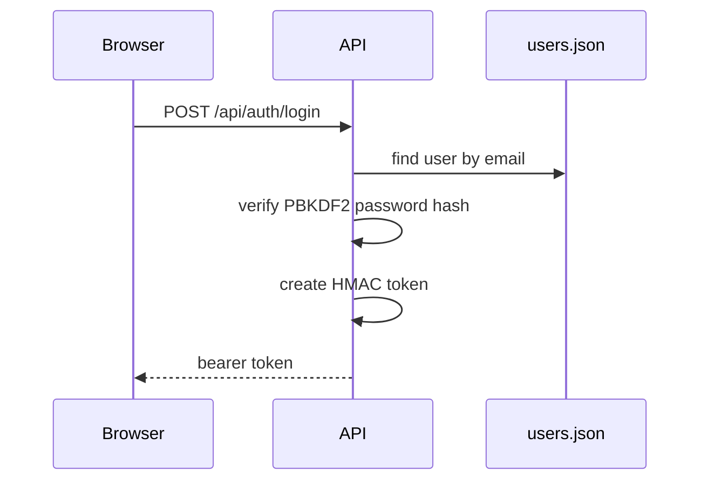
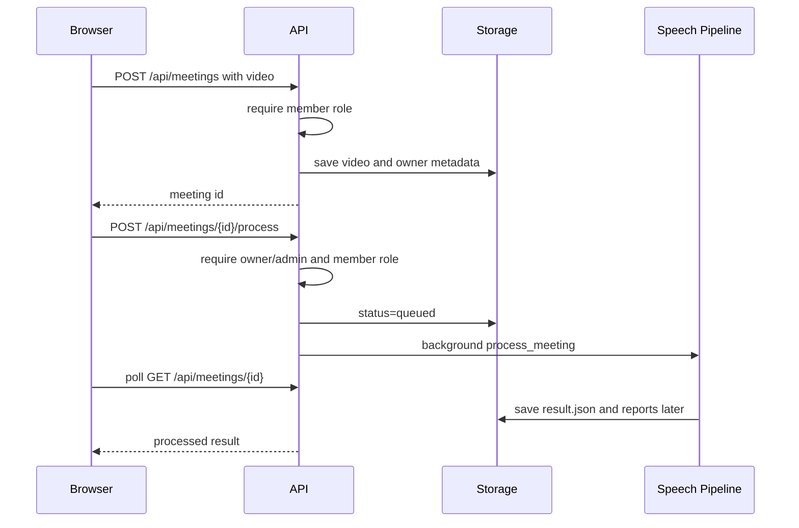
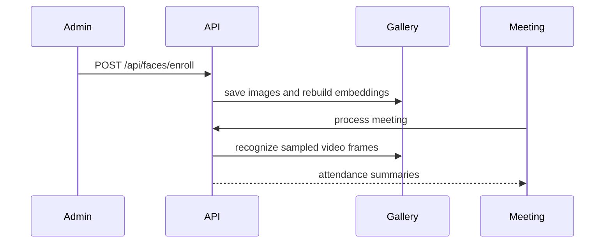

# ConvoLogix v2 Interview And Developer Study Guide

This document is written for two audiences:

- You, while preparing to explain ConvoLogix in interviews.
- A new developer who needs to understand the project architecture, codebase, design decisions, and tradeoffs quickly.

Use it as a project study guide, system-design explanation, demo script, and interview question bank.

## 1. One-Minute Project Pitch

ConvoLogix v2 is a secure, Dockerized meeting-intelligence web application. A user uploads a meeting recording, and the system generates a structured report containing transcription, "who said what" speaker summaries, optional face-based attendance, and downloadable or email-ready meeting minutes.

Version 2 modernizes the original local prototype into a web product:

- FastAPI backend
- Static browser frontend served by Nginx
- Docker Compose deployment
- role-based authentication
- protected meeting uploads and reports
- pretrained face recognition with OpenCV YuNet and SFace
- speech transcription with `faster-whisper`
- optional PyAnnote speaker diarization
- CI/CD workflows and release security checks

The most important interview framing is:

> "I converted a prototype meeting-minutes and face-attendance system into a deployable, secure, multi-user web application. I replaced custom CNN training with pretrained face-recognition models, added speaker diarization for 'who said what', protected user data with authentication and roles, containerized the stack with Docker, and added CI/security checks for public release."

## 2. Problem Statement

Meetings produce decisions, action items, technical discussions, and attendance records. In many teams, this information is captured manually or not captured at all. Manual meeting workflows have several problems:

- Notes are incomplete or inconsistent.
- Attendees may forget who said what.
- Attendance tracking can be manual or unreliable.
- Summaries are usually created after the meeting, which costs time.
- Meeting recordings and generated artifacts can contain private data and need access control.

ConvoLogix solves this by automating the post-meeting workflow:

1. Upload a meeting recording.
2. Extract audio from the video.
3. Transcribe speech to text.
4. Optionally diarize speakers.
5. Align speakers with transcript segments.
6. Detect enrolled faces from sampled video frames for attendance.
7. Generate a structured report.
8. Protect access with login, roles, and meeting ownership.

## 3. Core Features

### User And Security Features

- First-admin setup flow.
- Login endpoint that returns a bearer token.
- Role hierarchy:
  - `viewer`
  - `member`
  - `admin`
- Protected meeting upload and processing.
- Meeting ownership enforcement.
- Admin-only user management.
- Admin-only face enrollment.
- Admin-only diarization model access check.
- Ignored local runtime data and secrets.
- Security gate that blocks tracked private artifacts.

### Meeting Intelligence Features

- Meeting video upload.
- Background meeting processing.
- FFmpeg audio extraction.
- Whisper-compatible transcription via `faster-whisper`.
- Optional speaker diarization via PyAnnote.
- Speaker alignment by timestamp overlap.
- Speaker-turn merging.
- Extractive per-speaker summary.
- Attendance sampling from meeting video frames.
- Markdown and text report generation.
- Optional SMTP email report sending.

### Face Recognition Features

- Uses pretrained OpenCV YuNet for face detection.
- Uses pretrained OpenCV SFace for face embeddings.
- Does not train a custom CNN from scratch.
- Builds a local gallery of enrolled attendee embeddings.
- Matches uploaded images or sampled video frames by cosine similarity.
- Uses a configurable confidence threshold.

### Deployment And Release Features

- Dockerized FastAPI API.
- Dockerized Nginx frontend.
- Docker Compose orchestration.
- Mounted local `data/` directory for runtime state.
- Mounted local `models/` directory for ONNX models.
- GitHub Actions CI workflow.
- GitHub Actions image publishing workflow.
- Clean root-history release branch for public push.

## 4. High-Level Architecture



### Architecture In Plain English

The browser dashboard is a static frontend. It stores the API base URL and auth token in local storage, then calls the FastAPI backend. The backend owns all sensitive operations: authentication, authorization, meeting storage, speech processing, face recognition, and report generation.

Runtime files are stored locally under `data/`, while pretrained face models are mounted from `models/`. These folders are ignored by Git because they can contain sensitive or large files.

## 5. Repository Map

```text
backend/
  Dockerfile
  requirements.txt
  requirements-diarization.txt
  app/
    main.py
    config.py
    schemas.py
    services/
      auth.py
      storage.py
      face_recognition.py
      video_attendance.py
      speech_intelligence.py
      reporting.py
  tests/
    test_api_contract.py

frontend/
  Dockerfile
  nginx.conf
  index.html
  styles.css
  app.js

scripts/
  smoke-test.py
  beta-readiness.py
  security-check.py

docs/
  v2-roadmap.md
  v2-face-recognition.md
  v2-speech-diarization.md
  interview-study-guide.md

models/
  README.md

docker-compose.yml
.github/workflows/
  ci.yml
  publish-images.yml
```

### Legacy Prototype Folders

`Code/` and `CNN and other/` contain the older academic prototype code. They are useful for project history and comparison, but the deployable v2 product lives in `backend/`, `frontend/`, `scripts/`, `docs/`, and Docker files.

## 6. Backend Overview

The backend is a FastAPI app initialized in:

```text
backend/app/main.py
```

At startup it creates shared service instances:

- `settings = get_settings()`
- `face_service = OpenCVSFaceService(settings)`
- `attendance_service = VideoAttendanceService(settings, face_service)`
- `speech_service = SpeechIntelligenceService(settings, attendance_service)`
- `report_service = ReportService(settings)`
- `auth_service = AuthService(settings)`

This service layout keeps route handlers thin. Routes mainly validate auth, call a service, catch expected exceptions, and return Pydantic response models.

## 7. Backend Modules And Responsibilities

### `backend/app/config.py`

Purpose:

- Reads environment variables.
- Converts values into typed settings.
- Defines important filesystem paths.
- Provides `get_settings()` cached with `lru_cache`.

Important settings:

| Setting | Purpose |
| --- | --- |
| `CONVOLOGIX_DATA_DIR` | Runtime data root |
| `CONVOLOGIX_UPLOADS_DIR` | Meeting uploads |
| `CONVOLOGIX_ENROLLMENT_DIR` | Enrolled face images |
| `CONVOLOGIX_FACE_GALLERY_FILE` | Compressed face embedding gallery |
| `CONVOLOGIX_USERS_FILE` | JSON user store |
| `CONVOLOGIX_AUTH_ENABLED` | Enable/disable auth |
| `CONVOLOGIX_AUTH_SECRET_KEY` | HMAC signing secret |
| `CONVOLOGIX_AUTH_TOKEN_MINUTES` | Token lifetime |
| `CONVOLOGIX_FACE_DETECTOR_MODEL` | YuNet ONNX path |
| `CONVOLOGIX_FACE_RECOGNITION_MODEL` | SFace ONNX path |
| `CONVOLOGIX_FACE_MATCH_THRESHOLD` | Recognition confidence threshold |
| `CONVOLOGIX_ASR_MODEL` | Whisper model name |
| `CONVOLOGIX_DIARIZATION_MODEL` | PyAnnote model name |
| `HUGGINGFACE_TOKEN` / `HF_TOKEN` | PyAnnote gated model access |
| `CONVOLOGIX_SMTP_*` | Email report configuration |

Interview point:

> "I centralized runtime configuration in a settings object so Docker, local development, and CI can run the same code with different environment values."

### `backend/app/schemas.py`

Purpose:

- Defines Pydantic request and response models.
- Makes the API contract explicit.
- Validates response structure and some numeric bounds.

Important schemas:

- `AuthStatusResponse`
- `AuthTokenResponse`
- `UserResponse`
- `UserCreateRequest`
- `GalleryResponse`
- `EnrollmentResponse`
- `RecognitionResponse`
- `MeetingUploadResponse`
- `MeetingDetailResponse`
- `MeetingProcessResponse`
- `TranscriptSegment`
- `SpeakerTurn`
- `MeetingSummary`
- `AttendanceObservation`
- `AttendanceSummary`
- `EmailReportRequest`
- `EmailReportResponse`

Interview point:

> "Pydantic models helped me keep the frontend/backend contract predictable and made tests easier because every endpoint returns a known shape."

### `backend/app/main.py`

Purpose:

- Defines FastAPI routes.
- Adds CORS middleware.
- Creates auth dependencies.
- Enforces route-level roles.
- Enforces meeting ownership.
- Connects HTTP endpoints to service methods.

Important helper dependencies:

- `get_current_user()`
- `require_role(minimum_role)`
- `require_meeting_access(meeting_id, user, minimum_role)`

Important route groups:

| Endpoint | Role | Purpose |
| --- | --- | --- |
| `GET /api/health` | public | Health and model status |
| `GET /api/auth/status` | public | Auth enabled/setup status |
| `POST /api/auth/setup` | public if no users | Create first admin |
| `POST /api/auth/login` | public | Login and token creation |
| `GET /api/auth/me` | authenticated | Current user |
| `GET /api/auth/users` | admin | List users |
| `POST /api/auth/users` | admin | Create user |
| `GET /api/faces/gallery` | viewer | List enrolled people and model status |
| `POST /api/faces/enroll` | admin | Upload face images and rebuild gallery |
| `POST /api/faces/recognize` | member | Test recognition on an image |
| `POST /api/meetings` | member | Upload meeting video |
| `GET /api/meetings` | viewer | List allowed meetings |
| `GET /api/meetings/{id}` | viewer + owner/admin | Read detail/result |
| `POST /api/meetings/{id}/process` | member + owner/admin | Start background processing |
| `POST /api/meetings/{id}/process-sync` | member + owner/admin | Process synchronously |
| `GET /api/meetings/{id}/report.md` | viewer + owner/admin | Download Markdown |
| `GET /api/meetings/{id}/report.txt` | viewer + owner/admin | Download text |
| `POST /api/meetings/{id}/email-report` | member + owner/admin | Email report |
| `GET /api/speech/diarization-check` | admin | Verify PyAnnote access |

Interview point:

> "The security model is enforced server-side. The frontend hides UI based on roles, but the backend is the source of truth."

### `backend/app/services/auth.py`

Purpose:

- User creation.
- First-admin setup.
- Optional bootstrap admin.
- Password hashing.
- Login authentication.
- Bearer token creation and verification.
- Role checks.

Important implementation choices:

- Passwords are hashed with PBKDF2-SHA256.
- Each password uses a random salt.
- Iteration count: `210_000`.
- Tokens are HMAC-SHA256 signed JWT-like strings.
- Tokens include:
  - `sub`
  - `email`
  - `name`
  - `role`
  - `iat`
  - `exp`
- Tokens are verified with `hmac.compare_digest`.
- Users are stored in `users.json`.

Role hierarchy:

```python
ROLE_RANKS = {"viewer": 10, "member": 20, "admin": 30}
```

Important limitation:

- This is a lightweight local auth system, not a full enterprise identity provider.
- For production, consider OAuth/OIDC, refresh tokens, password reset, audit logs, and database-backed user management.

Interview point:

> "For v2 beta, I implemented a lightweight auth system with password hashing and signed bearer tokens. I also documented that a production deployment should use an external identity provider or stronger auth lifecycle features."

### `backend/app/services/storage.py`

Purpose:

- Creates workspace directories.
- Sanitizes names.
- Saves face images.
- Saves meeting videos.
- Reads/writes meeting metadata.
- Reads/writes meeting processing results.
- Lists meetings with ownership filtering.

Key storage files:

```text
data/
  users.json
  face_gallery.npz
  faces/
    <person-id>/
      <uuid>_<filename>.jpg
  uploads/
    meetings/
      <meeting-id>/
        meeting.json
        original-video-file.mp4
        audio.wav
        result.json
        reports/
          convologix-<meeting-id>.md
          convologix-<meeting-id>.txt
```

Meeting ids:

- Generated with `uuid.uuid4().hex[:12]`.
- Validated with regex `[a-f0-9]{12}`.

Supported image suffixes:

- `.jpg`
- `.jpeg`
- `.png`
- `.webp`

Supported video suffixes:

- `.mp4`
- `.mov`
- `.mkv`
- `.webm`
- `.avi`

Interview point:

> "For beta simplicity, I used filesystem storage with JSON metadata. It is easy to inspect and deploy locally, but the design can later move to PostgreSQL or object storage without changing the API contract."

### `backend/app/services/face_recognition.py`

Purpose:

- Loads OpenCV YuNet detector and SFace recognizer.
- Builds an embedding gallery from enrolled face images.
- Recognizes faces in uploaded images or video frames.

Why pretrained models:

- The original approach included custom CNN/LBPH training.
- For v2, the goal was better reliability and less training overhead.
- YuNet and SFace provide pretrained detection and embedding extraction.
- Enrollment becomes building a nearest-neighbor gallery, not training a new model.

Recognition flow:



Gallery build:

1. Iterate over each person folder.
2. Read each image.
3. Detect faces.
4. Use the largest face.
5. Extract SFace embedding.
6. Average embeddings per person.
7. Save compressed `.npz` with labels and embeddings.

Matching:

- Gallery embeddings are normalized.
- Input embedding is normalized.
- Similarity uses dot product.
- Best score above threshold becomes the identity.
- Otherwise result is `Unknown`.

Interview point:

> "I switched from training a CNN from scratch to using pretrained face embedding models. That reduced training complexity, avoided overfitting on small datasets, and made enrollment much faster."

### `backend/app/services/video_attendance.py`

Purpose:

- Samples frames from a meeting video.
- Runs face recognition on each sampled frame.
- Converts detections into attendance summaries.

Important settings:

- `CONVOLOGIX_ATTENDANCE_SAMPLE_INTERVAL_SECONDS`
- `CONVOLOGIX_ATTENDANCE_MAX_FRAMES`

Attendance flow:



Why sampling instead of every frame:

- Faster processing.
- Lower CPU cost.
- Enough for attendance evidence in many meetings.

Tradeoff:

- Sampling can miss someone who appears briefly.
- Increasing sample frequency improves recall but increases cost.

Interview point:

> "I intentionally sampled frames instead of processing every frame because this is an attendance feature, not a real-time surveillance system. It balances speed and useful evidence."

### `backend/app/services/speech_intelligence.py`

Purpose:

- Extracts audio from video.
- Transcribes speech.
- Optionally diarizes speakers.
- Assigns speakers to transcript segments.
- Builds speaker turns.
- Creates per-speaker summaries.
- Triggers attendance analysis.
- Saves final meeting result.

Processing flow:



Audio extraction:

- Uses FFmpeg.
- Outputs mono 16 kHz WAV.
- This format is friendly for ASR and diarization models.

Transcription:

- Uses `faster-whisper`.
- Loads `WhisperModel` lazily.
- Uses VAD filtering.
- Produces timestamped `TranscriptSegment` objects.

Diarization:

- Uses `pyannote.audio.Pipeline.from_pretrained`.
- Requires `HUGGINGFACE_TOKEN`.
- Requires accepting gated model terms.
- Optional min/max speaker hints are supported.

Speaker assignment:

- For each transcript segment, compare overlap with diarization turns.
- Assign the speaker with the largest timestamp overlap.
- If no diarization exists, speaker remains unassigned.

Speaker turns:

- Consecutive transcript segments from the same speaker are merged if close in time.
- This produces a more readable "who said what" transcript.

Summarization:

- Current summary is extractive and lightweight.
- Sentences are scored by length plus signal words like:
  - `decision`
  - `action`
  - `deadline`
  - `risk`
  - `owner`
  - `plan`
- Top sentences per speaker become `summary_by_speaker`.

Important limitation:

- The summary is not a large-language-model abstractive summary.
- It is deterministic and cheap, but can be improved later with a stronger summarizer.

Interview point:

> "I separated transcription, diarization, speaker alignment, summarization, and attendance into a clear pipeline. If one optional step fails, the system still produces a usable meeting report instead of failing the whole workflow."

### `backend/app/services/reporting.py`

Purpose:

- Builds Markdown reports.
- Converts Markdown-ish output to plain text.
- Writes report files to local runtime storage.
- Optionally sends the Markdown report through SMTP.

Report sections:

- meeting metadata
- diarization status
- attendance analysis note
- processing note
- "Who Said What"
- attendance
- speaker turns
- transcript

Email:

- Uses Python `smtplib`.
- SMTP values come from environment variables.
- Email is optional.
- Downloads work even when SMTP is not configured.

Interview point:

> "Report generation is server-side so protected downloads and email attachments use the same trusted backend output."

## 8. Frontend Overview

The frontend is a static app:

```text
frontend/index.html
frontend/styles.css
frontend/app.js
```

It is served by:

```text
frontend/nginx.conf
frontend/Dockerfile
```

Main frontend responsibilities:

- show first-admin setup screen
- login and store bearer token
- show/hide UI based on role
- call protected backend endpoints
- upload meeting videos
- upload face images
- start processing
- poll meeting status
- render speaker summaries and attendance
- download reports using authenticated fetch
- manage users as admin

Frontend state:

```javascript
const state = {
  apiBase,
  token,
  user,
  authEnabled,
  currentMeetingId,
  pollTimer,
};
```

Authentication behavior:

- Token is stored in `localStorage`.
- User is stored in `localStorage`.
- Protected requests add `Authorization: Bearer <token>`.
- If a protected request returns `401`, session is cleared and login is shown.

Role-aware UI:

- Elements use `data-min-role`.
- JavaScript compares role ranks and hides unauthorized controls.
- This is for usability only; backend still enforces security.

Interview point:

> "The frontend is intentionally simple and static. It does not require a Node build step. The backend owns sensitive logic, and the frontend focuses on workflow and visualization."

## 9. End-To-End User Flows

### First Admin Setup



### Login



### Meeting Processing



### Face Attendance



## 10. API Reference For Interviews

| Area | Endpoint | Method | Access | Explain It Like This |
| --- | --- | --- | --- | --- |
| Health | `/api/health` | GET | Public | Shows API, face model, and speech pipeline readiness |
| Auth | `/api/auth/status` | GET | Public | Tells frontend whether first admin setup is needed |
| Auth | `/api/auth/setup` | POST | First setup | Creates first admin and returns token |
| Auth | `/api/auth/login` | POST | Public | Verifies password and returns token |
| Auth | `/api/auth/me` | GET | User | Returns current authenticated user |
| Auth | `/api/auth/users` | GET | Admin | Lists users |
| Auth | `/api/auth/users` | POST | Admin | Creates viewer/member/admin |
| Face | `/api/faces/gallery` | GET | Viewer | Lists enrolled people and model status |
| Face | `/api/faces/enroll` | POST | Admin | Saves face images and rebuilds gallery |
| Face | `/api/faces/recognize` | POST | Member | Runs face recognition on one image |
| Speech | `/api/speech/diarization-check` | GET | Admin | Loads/verifies PyAnnote model access |
| Meetings | `/api/meetings` | POST | Member | Uploads a meeting video |
| Meetings | `/api/meetings` | GET | Viewer | Lists accessible meetings |
| Meetings | `/api/meetings/{id}` | GET | Viewer + owner/admin | Reads metadata and result |
| Meetings | `/api/meetings/{id}/process` | POST | Member + owner/admin | Starts background processing |
| Meetings | `/api/meetings/{id}/process-sync` | POST | Member + owner/admin | Processes synchronously for tests/manual use |
| Reports | `/api/meetings/{id}/report.md` | GET | Viewer + owner/admin | Downloads Markdown |
| Reports | `/api/meetings/{id}/report.txt` | GET | Viewer + owner/admin | Downloads text |
| Reports | `/api/meetings/{id}/email-report` | POST | Member + owner/admin | Sends email report |

## 11. Data Contracts To Remember

### Meeting Result

`MeetingProcessResponse` is the central output. It contains:

- `id`
- `title`
- `status`
- `diarization_enabled`
- `attendance_enabled`
- `attendance_message`
- `transcript`
- `speaker_turns`
- `summary_by_speaker`
- `attendance`
- `attendance_observations`
- `speech`
- `message`

### Transcript Segment

Each segment has:

- `start`
- `end`
- `speaker`
- `text`

### Speaker Turn

Each turn has:

- `speaker`
- `start`
- `end`
- `text`

### Attendance Summary

Each attendee summary has:

- `person`
- `first_seen`
- `last_seen`
- `detections`
- `best_confidence`

## 12. Docker And Deployment

### `docker-compose.yml`

Services:

- `api`
- `frontend`

API container:

- Based on Python 3.11 slim.
- Installs FFmpeg and system libraries.
- Installs backend requirements.
- Optionally installs PyTorch CPU and PyAnnote requirements when `CONVOLOGIX_INSTALL_DIARIZATION=true`.
- Mounts `./data:/app/data`.
- Mounts `./models:/app/models:ro`.
- Exposes port `8000`.

Frontend container:

- Based on Nginx Alpine.
- Serves static files.
- Exposes port `5180` on host mapped to container port `80`.

Important deployment decision:

> Models and data are mounted, not committed. This keeps the repository smaller and avoids publishing private biometric/runtime data.

### Health Checks

API health check:

- Calls `http://127.0.0.1:8000/api/health`.

Frontend health check:

- Uses `wget` against Nginx local endpoint.

## 13. CI/CD

### `ci.yml`

Runs on push and pull request.

Steps:

1. Checkout.
2. Set up Python 3.11.
3. Run `scripts/security-check.py`.
4. Compile backend and scripts.
5. Set up Node 22.
6. Run `node --check frontend/app.js`.
7. Validate Docker Compose config.
8. Build API and frontend Docker images.
9. Run API tests inside the image.

### `publish-images.yml`

Runs manually or on tags matching `v*`.

Publishes:

- `convologix-api`
- `convologix-frontend`

Target registry:

- GitHub Container Registry.

Interview point:

> "CI covers syntax, security hygiene, Docker buildability, and API contract tests. The publishing workflow is separated so image releases can be controlled manually or by version tags."

## 14. Security And Privacy Model

### What Is Protected

- Meeting upload requires `member`.
- Meeting processing requires `member`.
- Reports require meeting access.
- Email report requires `member`.
- Face enrollment requires `admin`.
- User management requires `admin`.
- Diarization model check requires `admin`.
- Non-admin users only see meetings they own.

### What Is Not Tracked

The release is designed to avoid tracking:

- `.env`
- `data/`
- `models/*.onnx`
- face datasets
- meeting videos
- generated reports
- extracted audio
- Python bytecode
- editor metadata
- notebook checkpoints

### Security Gate

`scripts/security-check.py` checks tracked files for:

- forbidden private directories
- model binaries
- generated files
- bytecode
- known legacy credential patterns
- `.env`

### Important Production Caveats

For production, improve:

- database-backed user store
- password reset
- refresh tokens
- token revocation
- audit logging
- rate limiting
- object storage for recordings
- HTTPS termination
- external identity provider
- stronger secret management

Interview point:

> "I treated public release as a security requirement, not just a deployment step. The current tree is clean, and I created a root-history release branch to avoid exposing old private artifacts in Git history."

## 15. Testing Strategy

### Unit/API Contract Tests

File:

```text
backend/tests/test_api_contract.py
```

What it checks:

- health response
- auth status and `/me`
- protected endpoints require auth
- gallery contract
- meetings contract
- diarization check contract without model load
- unknown meeting returns 404

The tests use:

- FastAPI `TestClient`
- temp data directory
- bootstrap admin credentials for isolated auth tests

### Scripts

`scripts/smoke-test.py`:

- checks health
- checks auth status
- can run protected checks after login
- can optionally create first admin when explicitly enabled

`scripts/beta-readiness.py`:

- checks auth
- checks face model readiness
- checks transcription readiness
- checks diarization dependencies and model load
- checks enrolled gallery
- checks meeting list endpoint
- can optionally create first admin when explicitly enabled

`scripts/security-check.py`:

- prevents publishing known private artifacts.

## 16. Key Design Decisions And Tradeoffs

### Pretrained Face Models Instead Of Training CNN

Why:

- Better for small datasets.
- Less training time.
- Less risk of overfitting.
- Easier deployment.
- Enrollment is lightweight.

Tradeoff:

- Depends on ONNX model availability.
- Accuracy depends on image quality, threshold, and enrollment diversity.

### File-Based Storage Instead Of Database

Why:

- Simple beta deployment.
- Easy to inspect.
- No database setup required.
- Works well for a local Docker Compose app.

Tradeoff:

- Not ideal for high concurrency.
- No advanced queries.
- No transactions beyond simple file replace.

Future:

- PostgreSQL for users/metadata.
- S3-compatible object storage for videos/reports.

### Optional Diarization

Why:

- PyAnnote is heavy.
- Gated model access complicates installation.
- Users can still get transcription without it.

Tradeoff:

- Without PyAnnote, speaker labels remain unassigned.

### Static Frontend

Why:

- No build step.
- Easy Nginx deployment.
- Simple for beta.

Tradeoff:

- Less structure than React/Vue.
- Larger `app.js` as features grow.

Future:

- Move to React/TypeScript if UI complexity increases.

### Background Processing

Why:

- Meeting processing can take minutes.
- API should return quickly after queueing.
- Frontend can poll for progress.

Tradeoff:

- FastAPI background tasks are simple but not a production queue.

Future:

- Celery/RQ/Arq worker queue.
- Redis for job state.

## 17. Common Interview Questions And Strong Answers

### Q1. What is ConvoLogix?

ConvoLogix is a secure meeting-intelligence web app. It accepts meeting recordings and generates structured reports with transcription, speaker-aware summaries, optional face-attendance detection, and report downloads or email delivery. Version 2 turns the original local prototype into a Dockerized FastAPI and Nginx web application with authentication, role-based access control, CI/CD, and release security checks.

### Q2. What problem does it solve?

It reduces manual work after meetings. Instead of manually writing minutes, tracking attendance, and remembering who said what, the app uses speech processing and computer vision to produce a structured report from the recording.

### Q3. What did you improve in v2?

I added a deployable web architecture, Docker Compose, a browser dashboard, FastAPI APIs, authentication and roles, protected meeting ownership, pretrained face recognition, optional diarization, report generation, CI/CD workflows, and security cleanup for public release.

### Q4. Why did you not train a CNN from scratch?

Training a CNN from scratch needs a large dataset, careful augmentation, tuning, and evaluation. For face recognition in a beta product, pretrained embedding models are more reliable. I used YuNet for detection and SFace for embeddings, then built a gallery of enrolled people and used nearest-neighbor matching.

### Q5. How does "who said what" work?

The app transcribes audio into timestamped segments using `faster-whisper`. If PyAnnote is configured, it produces speaker time ranges. The backend assigns each transcript segment to the speaker range with the largest timestamp overlap, merges nearby segments from the same speaker, and generates a per-speaker summary.

### Q6. What happens if diarization is not configured?

The system still extracts audio and transcribes the meeting. The meeting status becomes `processed_without_diarization`, and the report still includes transcript and attendance if available. This graceful degradation keeps the app useful even without the gated PyAnnote model.

### Q7. How is attendance calculated?

The app samples frames from the meeting video at configurable intervals. Each sampled frame is passed through face recognition. Known matches become attendance observations. The observations are grouped per person into first seen, last seen, detection count, and best confidence.

### Q8. How did you secure the app?

I added login, PBKDF2 password hashing, signed bearer tokens, role-based route dependencies, meeting ownership checks, admin-only operations, ignored private runtime data, and a security check script that blocks tracking secrets, model binaries, biometric folders, generated artifacts, bytecode, and editor metadata.

### Q9. Why use Docker?

Docker makes deployment repeatable. The backend needs Python, FFmpeg, OpenCV, optional PyAnnote/PyTorch, and environment variables. Docker Compose packages the API and frontend consistently and mounts runtime data and models safely.

### Q10. What are the biggest limitations?

The biggest limitations are file-based storage, lightweight local auth, simple extractive summarization, no production job queue, and PyAnnote gated model dependency. These are acceptable for beta but should be upgraded for production.

### Q11. How would you scale this?

I would move metadata and users to PostgreSQL, store videos and reports in object storage, run processing in a worker queue, use Redis for job state, add observability, use OAuth/OIDC for identity, add rate limiting, and deploy API/frontend separately behind HTTPS.

### Q12. How do you test it?

There are API contract tests using FastAPI TestClient, syntax checks for Python and frontend JavaScript, Docker image builds, Docker-based API tests, smoke checks against a running API, beta-readiness checks, and a security gate for tracked files.

### Q13. What was the hardest part?

A strong answer:

> "The hardest part was turning a research-style prototype into a secure deployable product. That required separating concerns, replacing local paths with configuration, protecting user data, keeping heavy model dependencies optional, and designing graceful fallback behavior when diarization or face models are not ready."

### Q14. What would you improve next?

Good next steps:

- production database
- real queue workers
- stronger summarization
- password reset and audit logs
- cloud storage
- better frontend framework
- speaker name mapping
- action-item extraction
- multi-language transcription
- meeting search

## 18. Interview Demo Script

Use this flow in an interview:

1. Start with the problem:
   - "Meetings generate important knowledge, but minutes and attendance are manual."

2. Explain v2 architecture:
   - "I split it into a FastAPI backend, static frontend, Docker Compose deployment, and local mounted model/data directories."

3. Show security:
   - "Every meeting belongs to a user. Roles decide who can upload, process, enroll faces, manage users, and view reports."

4. Show the pipeline:
   - "Upload video -> FFmpeg audio extraction -> faster-whisper transcription -> optional PyAnnote diarization -> speaker turns -> summaries -> attendance -> report."

5. Explain face recognition:
   - "I use YuNet and SFace pretrained models. Enrollment builds an embedding gallery; recognition is nearest-neighbor matching."

6. Explain deployment:
   - "Docker Compose runs the API and frontend. Models and data are mounted, not committed."

7. Explain release quality:
   - "I added CI, tests, smoke/beta scripts, and security checks before pushing the v2 branch."

8. End with tradeoffs:
   - "For beta, file storage and static frontend are simple. For production, I would add DB, queue workers, object storage, OAuth, and observability."

## 19. Deep Technical Talking Points

### Authentication Internals

- `AuthService` reads users from `users.json`.
- Passwords are never stored directly.
- Password hashes use PBKDF2-SHA256.
- Tokens are HMAC-signed.
- Expiration is checked on every protected request.
- User id from token must still exist in the current user store.

### Authorization Internals

- Routes use dependency injection.
- `require_role("admin")` means only admin can pass.
- `require_meeting_access()` verifies meeting owner unless user is admin.
- This prevents users from guessing meeting ids and reading others' reports.

### Speech Pipeline Internals

- FFmpeg command extracts WAV audio.
- Whisper model is lazy-loaded and reused.
- Diarization pipeline is also lazy-loaded.
- Failure during processing updates meeting status to `failed`.
- If diarization fails but transcription works, meeting can still be saved without speaker labels.

### Face Pipeline Internals

- Detector input size is set to each image's real width/height.
- SFace `alignCrop` normalizes the face crop before feature extraction.
- Person embeddings are averaged during gallery rebuild.
- Scores are dot products between normalized embeddings.
- Threshold determines known vs unknown identity.

### Report Internals

- Markdown is the canonical rich report.
- Text report is derived from Markdown.
- Reports are generated on demand and written to the meeting reports folder.
- Email attaches the Markdown report.

## 20. Current Known Beta Status

Based on the current v2 design:

- Face recognition is ready when both ONNX files are mounted and gallery exists.
- Transcription is ready when FFmpeg and `faster-whisper` are installed.
- Diarization requires PyAnnote package, token, and accepted gated model terms.
- A fresh deployment starts in first-admin setup mode.
- Protected API checks require a login token after setup.

If PyAnnote access fails, this is usually not a code error. It means the Hugging Face account must accept the gated model terms or the token does not have access.

## 21. How A New Developer Should Start

Recommended reading order:

1. `README.md`
2. `INSTALL.md`
3. `docs/interview-study-guide.md`
4. `backend/app/main.py`
5. `backend/app/schemas.py`
6. `backend/app/services/auth.py`
7. `backend/app/services/storage.py`
8. `backend/app/services/speech_intelligence.py`
9. `backend/app/services/face_recognition.py`
10. `frontend/app.js`
11. `docker-compose.yml`
12. `.github/workflows/ci.yml`

Recommended first local commands:

```bash
docker compose up -d --build
python scripts/security-check.py
python scripts/smoke-test.py http://127.0.0.1:8000
docker compose exec api python -m unittest discover -s tests
```

## 22. Glossary

ASR:

Automatic speech recognition, converting audio to text.

Diarization:

Separating speech by speaker. It answers "who spoke when".

Speaker turn:

A merged block of transcript text assigned to one speaker over a time interval.

Embedding:

A numeric vector representing a face. Similar faces should have nearby vectors.

Gallery:

The local set of known person embeddings used for recognition.

YuNet:

OpenCV pretrained face detector.

SFace:

OpenCV pretrained face recognition model that produces face embeddings.

PBKDF2:

A password hashing/key derivation algorithm used to store passwords safely.

Bearer token:

A signed token sent in the `Authorization` header to authenticate API calls.

## 23. Short Resume Bullets

Use or adapt these:

- Built ConvoLogix v2, a Dockerized FastAPI and Nginx web app for automated meeting transcription, speaker summaries, face-attendance detection, and report generation.
- Replaced custom CNN training with pretrained OpenCV YuNet/SFace face recognition and local embedding-gallery enrollment.
- Added role-based authentication, protected meeting ownership, admin user management, and secure report access.
- Integrated FFmpeg, `faster-whisper`, and optional PyAnnote diarization to generate "who said what" meeting summaries.
- Added Docker Compose deployment, GitHub Actions CI/CD, smoke/beta-readiness scripts, and tracked-file security checks for public release.

## 24. Honest Limitations To Mention

Good interviewers appreciate clear tradeoff awareness:

- The current user store is JSON-based; production should use a database.
- FastAPI background tasks are not a durable queue.
- The summary algorithm is extractive and should be upgraded for richer action-item extraction.
- Diarization depends on gated external model access.
- Face recognition needs consented, good-quality enrollment images.
- Static frontend is simple but should become a structured frontend app if complexity grows.
- Current auth is good for beta but should be replaced or extended for enterprise production.

## 25. Future Roadmap

High-impact improvements:

1. PostgreSQL for users, meetings, and audit logs.
2. Object storage for videos, audio, and reports.
3. Redis/Celery or another durable worker queue.
4. OAuth/OIDC login.
5. Password reset and invitation flow.
6. Action item and decision extraction.
7. Speaker name mapping from diarization speakers to enrolled people.
8. Search across meetings and transcripts.
9. Multi-language transcription.
10. Observability: logs, metrics, tracing.
11. Better frontend state management and TypeScript.
12. HTTPS deployment with secure cookies or improved token storage.

## 26. Final Mental Model

Remember ConvoLogix v2 as five connected systems:

1. Auth system:
   - Who are you, and what can you access?

2. Storage system:
   - Where are users, meetings, videos, results, and reports stored?

3. Speech system:
   - What was said, when, and by which speaker?

4. Vision system:
   - Which enrolled people appeared in the meeting video?

5. Delivery system:
   - How does the user review, download, email, test, and deploy the output?

If you can explain these five systems clearly, you can explain the whole project confidently.
